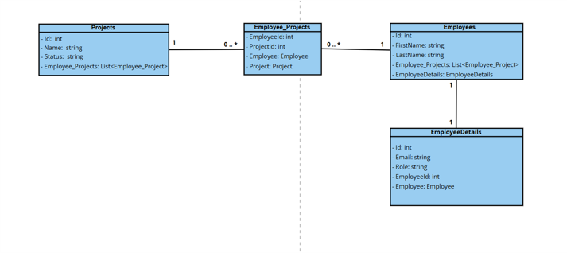
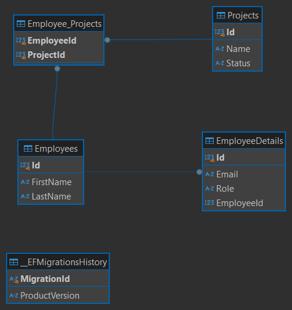
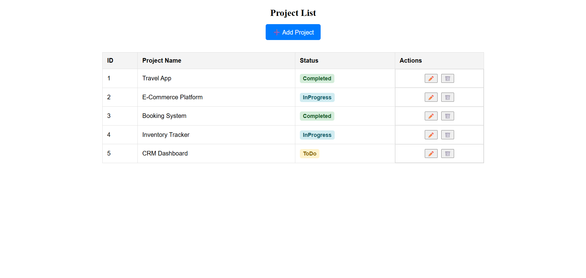
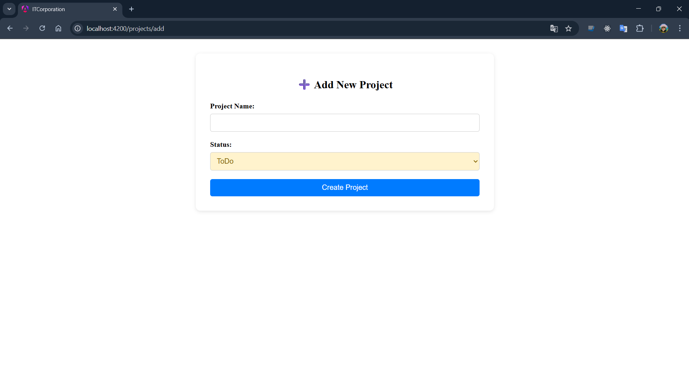
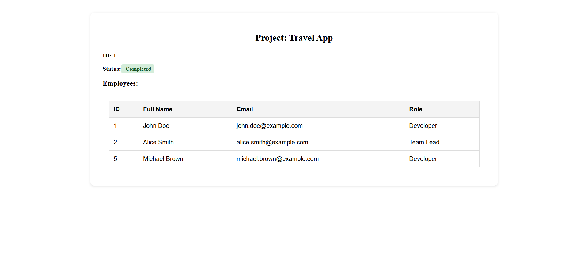
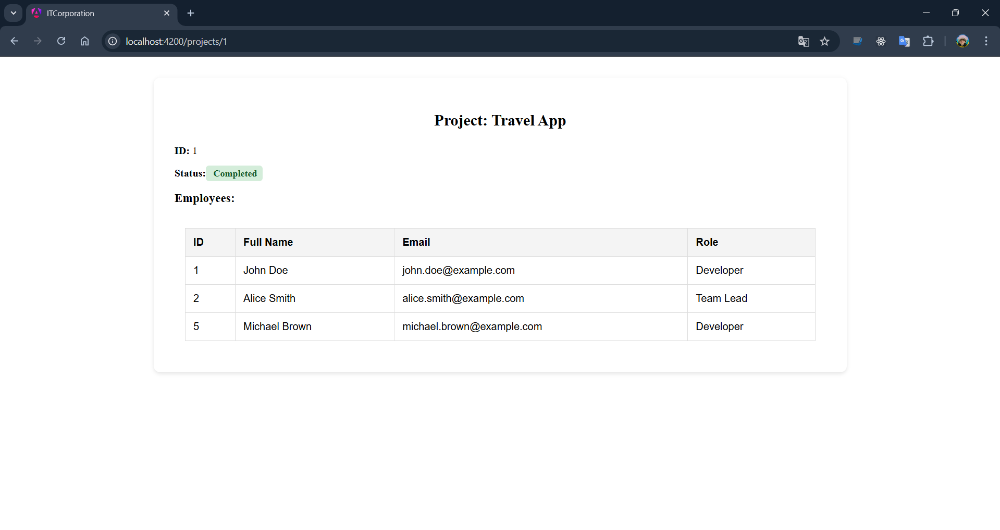

# 🏢 ITCorporations — FullStack Web Application

---

## Contents 📋

0. [Project Objective](#intro)
1. [Technologies Used](#techn)
2. [Diagrams](#diagrams)
3. [Project architecture](#arch)
4. [Implemented API Endpoints](#endpoints)
5. [Backend Tests](#tests)
6. [Frontend Features](#frontend_features)
7. [UI Preview](#ui_preview)
8. [Conclusion](#conclusion)
9. [Instructions for installing the application locally](#init)

---

<a name="intro"></a>
## 0. Project Objective 🎯

The goal of this project is to demonstrate a complete working example of a full-stack web application, including seamless interaction between frontend and backend, RESTful API communication, database operations (including stored procedures), and automated testing with both unit and integration coverage.

---

<a name="techn"></a>
## 1. Technologies Used ⚙️

### 🔧 Backend
- **ASP.NET Core 9**, **C#**
- **Entity Framework Core** – used for database read operations
- **Stored Procedures (PostgreSQL)** – used for updating project data
- **PostgreSQL** – relational database
- **MSTest** – for unit and integration tests

### 🌐 API
- **RESTful API**
- **Swagger** – for API documentation and testing
- **Postman** – for manual API testing

### 💻 Frontend
- **Angular 17**
- **HTML**, **TypeScript**, **CSS**

### 👷Patterns
- **Data Transfer Object**
- **Repository**
- **Client-Server Architecture**
- **Arrange, Act, Assert**

### 🩻 Tests
- **Unit test**
- **Intrgration test**

### 📦 Containerization
- **Docker**
---

<a name="diagrams"></a>
## 2. Diagrams 📊

### Diagram Class (UML)


 
### Entity–Relationship Diagram (ERD)



---

<a name="arch"></a>
## 3. Project architecture 📑


```
├── 📁 .github
│   └── 📁 workflows
├── 📁 API
│   ├── 📁 Controllers
│   │   ├── 📄 EmployeesController.cs
│   │   └── 📄 ProjectsController.cs
│   ├── 📁 DTOs
│   │   ├── 📄 CreateUpdateEmployeeDto.cs
│   │   ├── 📄 CreateUpdateProjectDto.cs
│   │   ├── 📄 EmployeeDto.cs
│   │   ├── 📄 ProjectDto.cs
│   │   └── 📄 ProjectWithEmployeesDto.cs
│   ├── 📁 Data
│   │   └── 📄 AppDbContext.cs
│   ├── 📁 Entities
│   │   ├── 📄 Employee.cs
│   │   ├── 📄 EmployeeDetails.cs
│   │   ├── 📄 Employee_Project.cs
│   │   └── 📄 Project.cs
│   ├── 📁 Helpers
│   │   └── 📄 AutoMapperProfile.cs
│   ├── 📁 Interfaces
│   │   ├── 📄 IEmployeeRepository.cs
│   │   └── 📄 IProjectRepository.cs
│   ├── 📁 Properties
│   │   └── ⚙️ launchSettings.json
│   ├── 📁 Repositories
│   │   ├── 📄 EmployeeRepository.cs
│   │   └── 📄 ProjectRepository.cs
│   ├── 📄 API.csproj
│   ├── 📄 API.http
│   ├── 🐳 Dockerfile
│   ├── 📄 Program.cs
│   ├── ⚙️ appsettings.Development.json
│   └── ⚙️ appsettings.json
├── 📁 API.Tests
│   ├── 📁 Integration
│   │   ├── 📁 Controller
│   │   │   └── 📄 ProjectsControllerTests.cs
│   │   └── 📄 IntegrationTestClassBase.cs
│   ├── 📁 Unit
│   │   ├── 📁 Controller
│   │   │   └── 📄 ProjectsControllerTests.cs
│   │   └── 📄 UnitTestClassBase.cs
│   ├── 📄 API.Tests.csproj
│   └── 📄 MSTestSettings.cs
├── 📁 Client
│   ├── 📁 .angular
│   ├── 📁 src
│   │   ├── 📁 app
│   │   │   ├── 📁 _models
│   │   │   │   ├── 📄 employee.model.ts
│   │   │   │   └── 📄 project.model.ts
│   │   │   ├── 📁 _services
│   │   │   │   ├── 📄 employee.service.ts
│   │   │   │   └── 📄 project.service.ts
│   │   │   ├── 📁 projects
│   │   │   │   ├── 📁 add-project
│   │   │   │   │   ├── 🎨 add-project.component.css
│   │   │   │   │   ├── 🌐 add-project.component.html
│   │   │   │   │   └── 📄 add-project.component.ts
│   │   │   │   ├── 📁 edit-project
│   │   │   │   │   ├── 🎨 edit-project.component.css
│   │   │   │   │   ├── 🌐 edit-project.component.html
│   │   │   │   │   └── 📄 edit-project.component.ts
│   │   │   │   ├── 📁 project-details
│   │   │   │   │   ├── 🎨 project-details.component.css
│   │   │   │   │   ├── 🌐 project-details.component.html
│   │   │   │   │   └── 📄 project-details.component.ts
│   │   │   │   └── 📁 project-list
│   │   │   │       ├── 🎨 project-list.component.css
│   │   │   │       ├── 🌐 project-list.component.html
│   │   │   │       └── 📄 project-list.component.ts
│   │   │   ├── 🎨 app.component.css
│   │   │   ├── 🌐 app.component.html
│   │   │   ├── 📄 app.component.ts
│   │   │   ├── 📄 app.config.ts
│   │   │   └── 📄 app.routes.ts
│   │   ├── 📁 assets
│   │   │   └── ⚙️ .gitkeep
│   │   ├── 📄 favicon.ico
│   │   ├── 🌐 index.html
│   │   ├── 📄 main.ts
│   │   └── 🎨 styles.css
│   ├── ⚙️ .editorconfig
│   ├── ⚙️ .gitignore
│   ├── 🐳 Dockerfile
│   ├── 📝 README.md
│   ├── ⚙️ angular.json
│   ├── ⚙️ nginx.conf
│   ├── ⚙️ package-lock.json
│   ├── ⚙️ package.json
│   ├── ⚙️ tsconfig.app.json
│   ├── ⚙️ tsconfig.json
│   └── ⚙️ tsconfig.spec.json
├── 📁 Database
│   ├── 🖼️ ERD-ITCorporationDb.png
│   └── 📄 ScriptSQL-ITCorporation.sql
├── 📁 Presentations
│   ├── 📄 Presentation_Backend_Database - (Eng.).pptx
│   └── 📄 Presentation_Backend_Database.pptx
├── 📁 source
│   ├── 🖼️ DiagramClass.png
│   ├── 🖼️ ERD.png
│   ├── 🖼️ folder-migration.png
│   ├── 🖼️ image-1.png
│   ├── 🖼️ image-2.png
│   ├── 🖼️ image-3.png
│   ├── 🖼️ image-4.png
│   ├── 🖼️ image-5.png
│   ├── 🖼️ image-6.png
│   ├── 🖼️ image-7.png
│   └── 🖼️ image.png
├── ⚙️ .gitattributes
├── ⚙️ .gitignore
├── 📄 ITCorporation.sln
├── 📝 README.md
└── ⚙️ docker-compose.yml
```

---

<a name="endpoints"></a>
## 4. Implemented API Endpoints 🔗

### 👨‍💼 Employees

| Method | Endpoint                        | Description                  |
|--------|----------------------------------|------------------------------|
| GET    | `/api/Employees`                | Get all employees            |
| POST   | `/api/Employees`                | Create a new employee        |
| GET    | `/api/Employees/{id}`           | Get employee by ID           |
| PUT    | `/api/Employees/{id}`           | Update employee              |
| DELETE | `/api/Employees/{id}`           | Delete employee              |

### 📁 Projects

| Method | Endpoint                                                             | Description                                      |
|--------|----------------------------------------------------------------------|--------------------------------------------------|
| GET    | `/api/Projects`                                                     | Get all projects                                 |
| POST   | `/api/Projects`                                                     | Create a new project                             |
| GET    | `/api/Projects/{id}`                                                | Get project by ID                                |
| PUT    | `/api/Projects/{id}`                                                | Update project (via stored procedure)            |
| DELETE | `/api/Projects/{id}`                                                | Delete project                                   |
| GET    | `/api/Projects/{id}/with-employees`                                 | Get project along with assigned employees        |
| POST   | `/api/Projects/{projectId}/employees/{employeeId}`                 | Assign employee to project                       |
| DELETE | `/api/Projects/{projectId}/employees/{employeeId}`                 | Remove employee from project                     |
| PUT    | `/api/Projects/simulate-not-found-project/{id}`                    | Simulate not found error for testing             |
| POST   | `/api/Projects/simulate-bad-request-create-project`                | Simulate bad request on project creation         |

---

<a name="tests"></a>
## 5. Backend Tests 🧪

### ✅ Unit Tests
- `GetAllProjects_ReturnsAllProjects`

### ❌ Integration Tests
- `CreateProject`
- `CreateProject_ShouldFail_When...` (fails due to validation mismatch)

---

<a name="frontend_features"></a>
## 6. Frontend Features 🖥️

- **Project List Page** — Displays all projects in a table format with actions to edit or delete.
- **Add Project Page** — Form to create a new project with name and status fields.
- **Edit Project Page** — Allows updating the project name and status.
- **Project Details Page** — Shows the project along with assigned employees and their roles.

---

<a name="ui_preview"></a>
## 7. UI Preview 📷

> The screenshots below show some of the implemented UI components:

- Project List with Actions  



- Add Project  



- Edit Project



- Project Details with Assigned Employees



---

<a name="conclusion"></a>
## 8 Conclusion ✅

**ITCorporations** is a complete example of a CRUD-based enterprise app that includes:
- Full frontend-backend interaction
- Client-Server Architecture
- Automated tests
- Real-world practices like stored procedures, REST APIs, and component-based frontend development.

---

<a name="init"></a>
## 9. Instructions for installing the application locally ☕️

> The project uses **Docker**, so Node.js, .NET SDK, Angular CLI, and PostgreSQL do **not** need to be installed manually — everything runs inside containers.

### I. Install Programs

1. Download and install **Docker Desktop**  
   https://www.docker.com/products/docker-desktop

2. Download and install **Git**  
   https://git-scm.com/downloads

3. Download **VS Code** *(optional — for development only)*  
   https://code.visualstudio.com/download

---

### II. Run the Project

1. Clone the repository:

```powershell
git clone <repository-url>
```

2. From the root of the project, build and start all services:

```powershell
docker-compose up --build
```

This single command will:
- Start a **PostgreSQL 17** database
- Build and run the **.NET 9 API** — migrations are applied automatically on startup
- Build the **Angular** app and serve it via **nginx**

3. Open the application in your browser:

```
http://localhost:4200
```

---

### III. Seed the Database

The database schema is created automatically, but the initial data must be loaded once manually.

Run the seed script via Docker:

```powershell
docker exec -i itcorporation-db-1 psql -U postgres -d ITCorporationDb < Database/ScriptSQL-ITCorporation.sql
```

> **Note:** `itcorporation-db-1` is the default container name generated by Docker Compose based on the project folder name. If the command fails, check the actual container name with `docker ps`.


